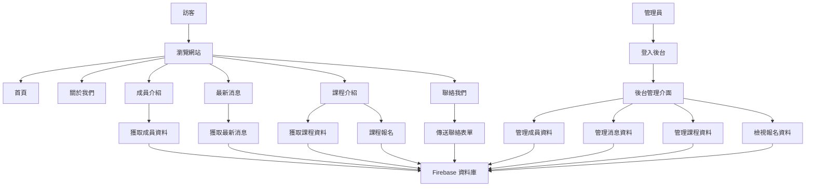
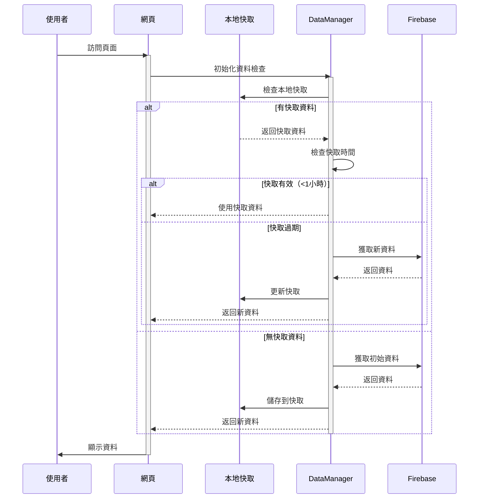
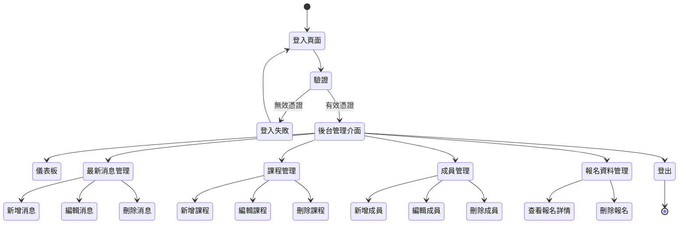
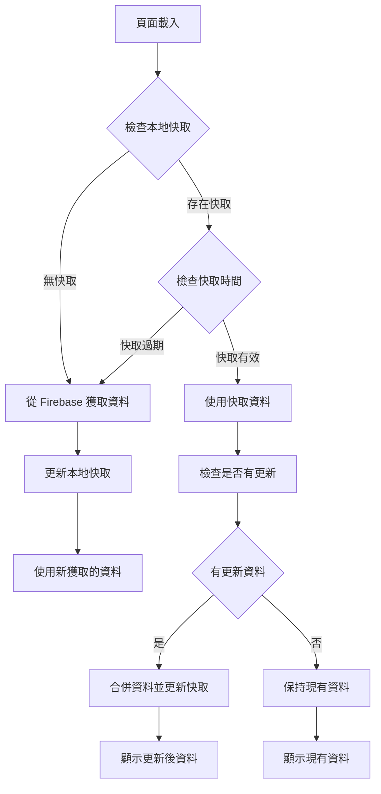
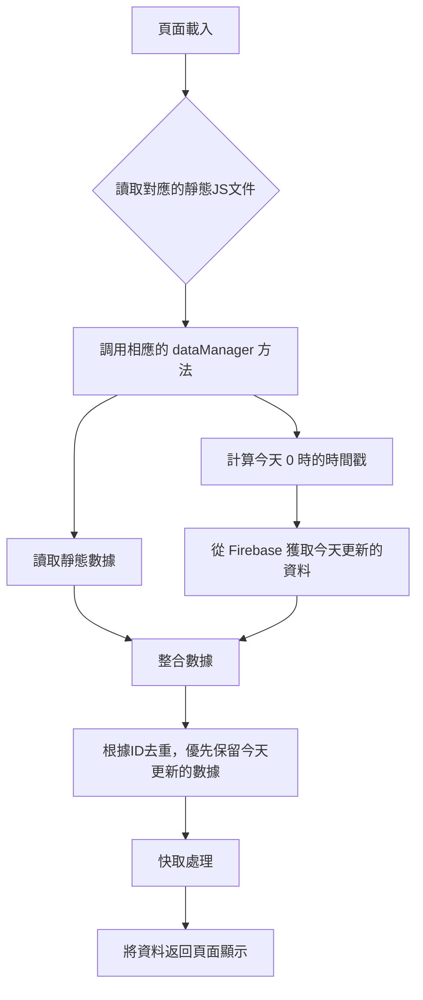

# 國際遊戲協會台灣分會官方網站

本專案是國際遊戲協會台灣分會 (IPAT) 的官方網站，使用 HTML、Bootstrap 5 和 Firebase 構建。

設計開發 Zero Lin
## 專案結構

- **首頁 (index.html)**: 網站主頁，展示協會基本資訊、最新消息和課程概覽
- **關於我們 (about.html)**: 介紹協會宗旨、歷史和組織架構
- **成員介紹 (member.html)**: 展示協會的成員資訊（動態從 Firebase 獲取）
- **最新消息 (news.html)**: 顯示協會的最新動態和公告，以卡片式布局呈現（動態從 Firebase 獲取）
- **課程介紹 (course.html)**: 展示協會提供的課程資訊，含報名功能（動態從 Firebase 獲取）
- **聯絡我們 (contact.html)**: 提供聯絡表單和協會聯絡資訊
- **後台管理 (Backstage.html)**: 管理員後台，用於管理網站內容
- **js/firebase-data.js**: 處理 Firebase 資料獲取和管理的 JavaScript 檔案

## 技術架構

- **前端技術**: HTML5, CSS3, Bootstrap 5, JavaScript
- **後端服務**: Firebase (Firestore, Authentication, Storage)
- **資料管理**: 使用 Firebase Firestore 儲存和獲取動態資料
- **檔案儲存**: 使用 Firebase Storage 儲存和獲取圖片
- **使用者認證**: 使用 Firebase Authentication 進行後台管理登入

## 資料流程

下面的流程圖解釋了網站的數據流和使用者互動流程：



## 資料獲取流程



## 後台管理流程



## 快取資料管理機制



## 安裝和使用

1. 克隆此儲存庫
2. 配置 Firebase 專案（Firestore、Authentication 和 Storage）
3. 更新 `firebase-data.js` 中的 Firebase 配置
4. 將檔案部署到網頁伺服器

## 後台管理使用說明

1. 訪問 `Backstage.html` 進入後台登入頁面
2. 使用管理員帳號和密碼登入
3. 登入後可以管理網站的各項內容：
   - 最新消息管理（包含標題、內容、相關連結和圖片上傳）
   - 課程管理（包含課程詳情、時間設定和相關連結）
   - 成員管理（包含成員資訊、職位和相關連結）
   - 報名資料查看

## 授權和版權

© Copyright 2025. 國際遊戲協會台灣分會 (IPAT)。網頁設計 By Zero.Lin

## 專案簡介
這是國際遊戲協會台灣分會的官方網站，包含以下主要功能：
- 協會介紹與最新消息
- 課程報名與管理
- 成員介紹
- 後台管理系統

## 資料結構說明
Firebase Firestore 資料庫結構：

- `news`: 最新消息資料（標題、內容、更新時間、URL連結）
- `course`: 課程資料（課程名稱、內容、開始和結束日期、URL連結）
- `member`: 成員資料（姓名、職位、介紹、URL連結）
- `Registration`: 報名資料
- `delectlog`: 資料刪除日誌

## 安全性注意事項
1. 後台管理頁面需要管理員登入才能訪問

## 前台頁面資料獲取流程

### 資料獲取核心邏輯
所有頁面的核心數據獲取邏輯如下：
1. 靜態數據來自對應的 JS 文件（news.js, course.js, member.js）
2. 動態數據從 Firebase 獲取，只請求今天 0 時之後更新的記錄（通過 updatetime 字段篩選）
3. 合併兩種數據，優先顯示今天從 Firebase 獲取的最新數據，然後是靜態數據
4. 利用數據 ID 進行去重處理，確保不顯示重複內容

### 首頁 (index.html)
首頁從 Firebase 獲取最新消息和課程資料，並顯示在頁面上。

1. 頁面載入時觸發 `DOMContentLoaded` 事件
2. 調用 `window.dataManager.getNewsForIndex()` 獲取最新 3 則新聞
3. 調用 `window.dataManager.getCoursesForIndex()` 獲取最新 4 個課程
4. 獲取到資料後分別調用 `updateNewsSection()` 和 `updateCoursesSection()` 更新頁面內容

### 成員介紹頁面 (member.html)
成員介紹頁面從 Firebase 獲取成員資料，並按職位順序顯示。

1. 頁面載入時觸發 `DOMContentLoaded` 事件
2. 調用 `window.dataManager.getMembers()` 獲取所有成員資料
3. 獲取到資料後調用 `renderMembers()` 將成員資料渲染到頁面
   - 渲染時會先按職稱對成員進行排序，領導職位優先顯示

### 最新消息頁面 (news.html)
最新消息頁面從 Firebase 獲取所有新聞資料，並以卡片式布局呈現。

1. 頁面載入時觸發 `DOMContentLoaded` 事件
2. 調用 `window.dataManager.getNews()` 獲取所有新聞資料並按更新時間排序（最新的在前）
3. 獲取到資料後調用 `displayNewsCards()` 將新聞資料以卡片格式渲染到頁面
4. 點擊卡片時調用 `showNewsDetail()` 顯示新聞詳情模態框，包含完整內容和相關連結
5. 新聞圖片從 Firebase Storage 獲取，使用新聞 ID 作為檔名

### 課程介紹頁面 (course.html)
課程介紹頁面從 Firebase 獲取所有課程資料，並提供課程詳情查看和報名功能。

1. 頁面載入時觸發 `DOMContentLoaded` 事件
2. 調用 `window.dataManager.getCourses()` 獲取所有課程資料
3. 獲取到資料後調用 `renderCourses()` 將課程資料渲染到頁面
4. 點擊課程卡片時調用 `showCourseDetail(courseId)` 顯示課程詳情
5. 點擊「報名課程」按鈕時開啟報名表單
6. 提交報名表單時調用 `submitEnrollment()` 將報名資料保存到 Firebase

### 資料獲取流程圖



### DataManager 資料獲取實現原理

所有頁面使用的 `DataManager` 類中，資料獲取方法的實現原理如下：

```javascript
async getXXX() {
    // 1. 計算今天 0 時的時間戳
    const todayStart = this.getTodayStartTimestamp();
    
    // 2. 獲取靜態數據
    let staticData = [];
    if (window.xxx) {  // 對應的 JS 文件中的數據 (news.js, course.js, member.js)
        staticData = window.xxx;
    }
    
    // 3. 從 Firebase 獲取今天更新的數據
    const snapshot = await window.db.collection('xxx')
        .where('updatetime', '>=', new Date(todayStart))
        .orderBy('updatetime', 'desc')
        .get();
    
    // 4. 處理 Firebase 獲取的數據
    const firestoreData = snapshot.docs.map(doc => ({
        id: doc.id,
        ...doc.data()
    }));
    
    // 5. 合併數據（避免重複的 ID）
    const existingIds = new Set(firestoreData.map(item => item.id));
    const filteredStaticData = staticData.filter(item => !existingIds.has(item.id));
    
    // 6. 返回合併結果（Firebase 數據優先）
    return [...firestoreData, ...filteredStaticData];
}
```

### 共用的資料管理函數

所有頁面共用的 `DataManager` 類包含以下關鍵函數：

1. `getTodayStartTimestamp()` - 計算今天 0 時的時間戳
2. `setCache(key, data)` - 設置資料快取
3. `getFromCache(key)` - 從快取獲取資料
4. `hasValidCache(key)` - 檢查快取是否有效（30 分鐘內）
5. `hasCache(key)` - 檢查是否存在快取
6. `getLastUpdateTime(key)` - 獲取最後更新時間