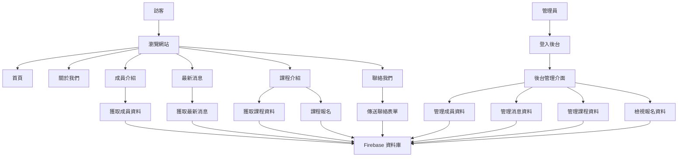
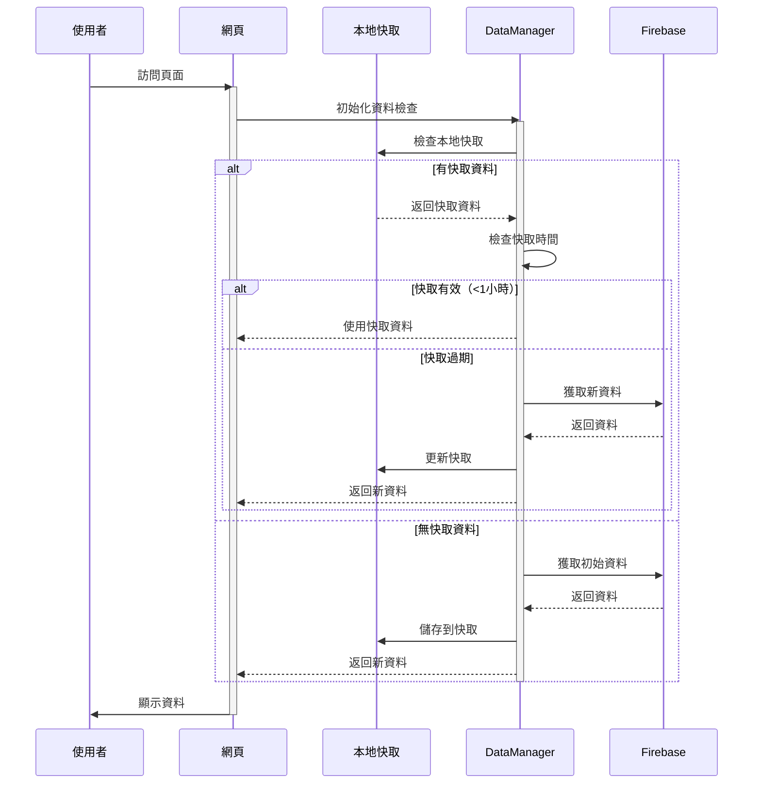
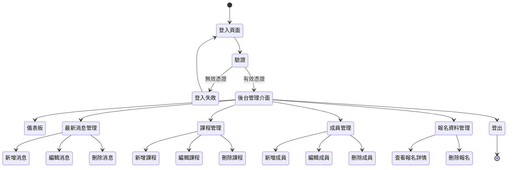
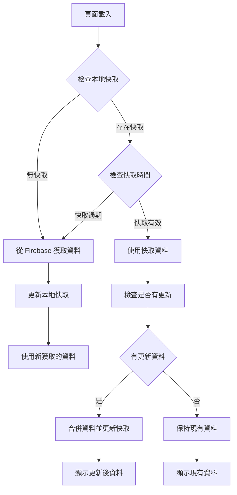

# 國際遊戲協會台灣分會官方網站

本專案是國際遊戲協會台灣分會 (IPAT) 的官方網站，使用 HTML、Bootstrap 5 和 Firebase 構建。

## 專案結構

- **首頁 (index.html)**: 網站主頁，展示協會基本資訊、最新消息和課程概覽
- **關於我們 (about.html)**: 介紹協會宗旨、歷史和組織架構
- **成員介紹 (member.html)**: 展示協會的成員資訊（動態從 Firebase 獲取）
- **最新消息 (news.html)**: 顯示協會的最新動態和公告（動態從 Firebase 獲取）
- **課程介紹 (course.html)**: 展示協會提供的課程資訊，含報名功能（動態從 Firebase 獲取）
- **聯絡我們 (contact.html)**: 提供聯絡表單和協會聯絡資訊
- **後台管理 (Backstage.html)**: 管理員後台，用於管理網站內容
- **js/firebase-data.js**: 處理 Firebase 資料獲取和管理的 JavaScript 檔案

## 技術架構

- **前端技術**: HTML5, CSS3, Bootstrap 5, JavaScript
- **後端服務**: Firebase (Firestore, Authentication)
- **資料管理**: 使用 Firebase Firestore 儲存和獲取動態資料
- **使用者認證**: 使用 Firebase Authentication 進行後台管理登入

## 資料流程

下面的流程圖解釋了網站的數據流和使用者互動流程：

## 資料獲取流程

## 後台管理流程

## 快取資料管理機制

## 安裝和使用

1. 克隆此儲存庫
2. 配置 Firebase 專案（Firestore 和 Authentication）
3. 更新 `firebase-data.js` 中的 Firebase 配置
4. 將檔案部署到網頁伺服器

## 後台管理使用說明

1. 訪問 `Backstage.html` 進入後台登入頁面
2. 使用管理員帳號和密碼登入
3. 登入後可以管理網站的各項內容：
   - 最新消息管理
   - 課程管理
   - 成員管理
   - 報名資料查看

## 授權和版權

© Copyright 2025. 國際遊戲協會台灣分會 (IPAT)。網頁設計 By Zero.Lin